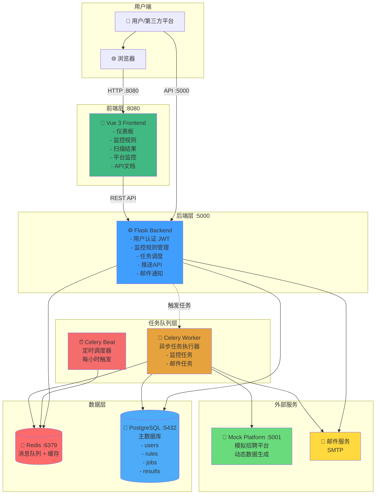
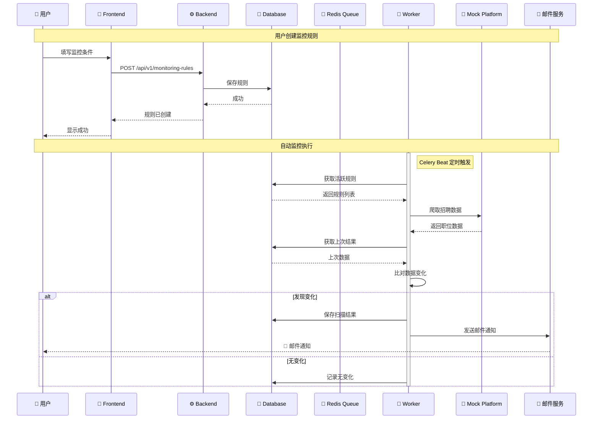
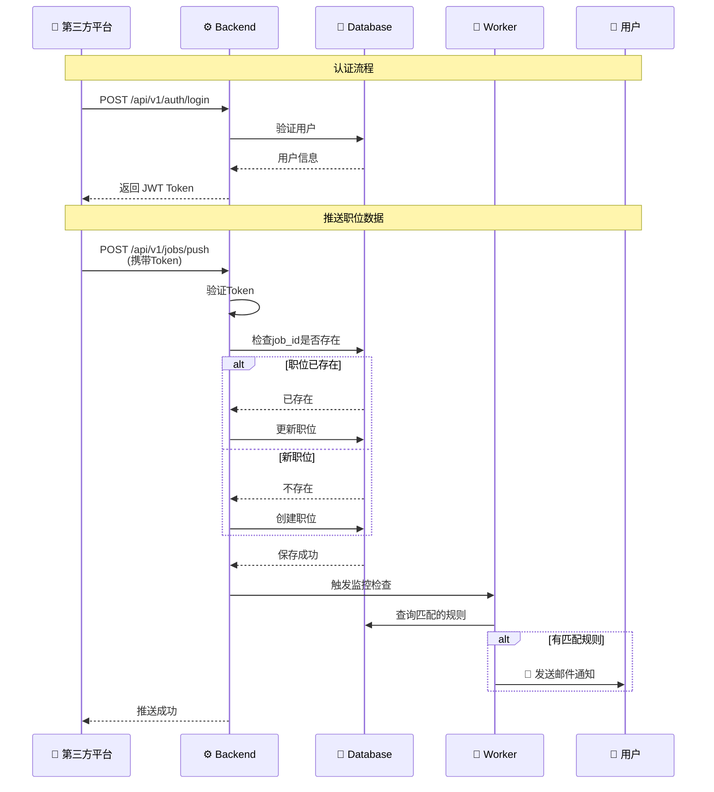
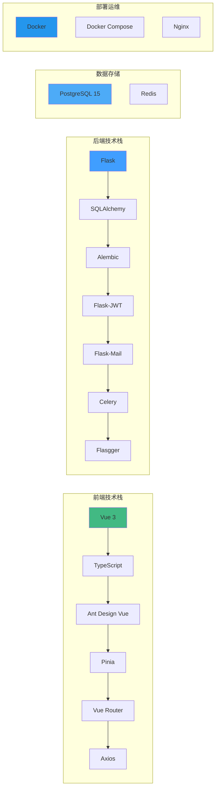
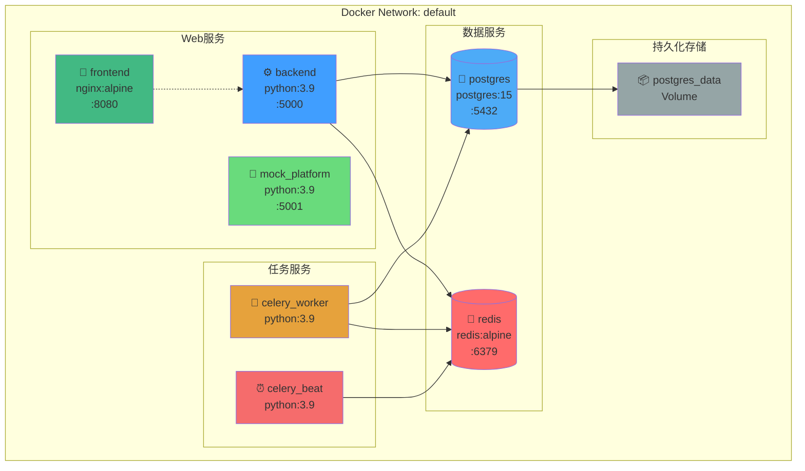
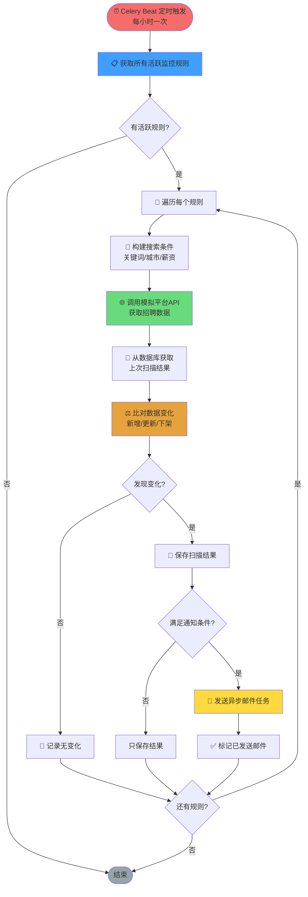
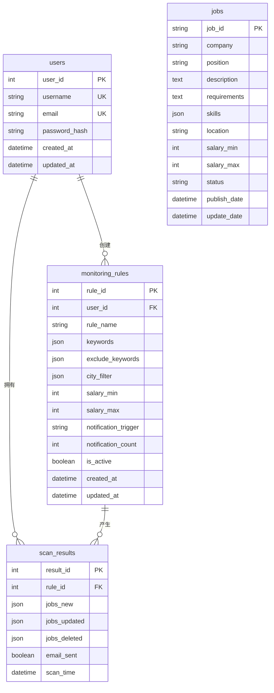

# 系统架构图 (Mermaid 格式)

> 在支持Mermaid的环境中（GitHub、Typora、VS Code等）可以看到图形化显示

## 1️⃣ 整体架构图



## 2️⃣ 数据流向图



## 3️⃣ 第三方推送流程



## 4️⃣ 技术栈架构



## 5️⃣ Docker容器架构



## 6️⃣ 监控任务执行流程



## 7️⃣ 数据库ER图



## 8️⃣ API路由架构

```mermaid
graph LR
    API[/api/v1/] --> Auth[/auth]
    API --> Rules[/monitoring-rules]
    API --> Results[/scan-results]
    API --> Jobs[/jobs]
    API --> Push[/jobs/push]

    Auth --> Login[POST /login<br/>用户登录]
    Auth --> Register[POST /register<br/>用户注册]
    Auth --> Refresh[POST /refresh<br/>刷新Token]
    Auth --> Current[GET /current<br/>当前用户]

    Rules --> GetRules[GET /<br/>获取规则列表]
    Rules --> CreateRule[POST /<br/>创建规则]
    Rules --> GetRule[GET /:id<br/>获取单个规则]
    Rules --> UpdateRule[PUT /:id<br/>更新规则]
    Rules --> DeleteRule[DELETE /:id<br/>删除规则]
    Rules --> TestRule[POST /:id/test<br/>测试规则]

    Results --> GetResults[GET /<br/>获取结果列表]
    Results --> GetResult[GET /:id<br/>获取单个结果]
    Results --> Stats[GET /stats<br/>统计信息]

    Jobs --> SearchJobs[GET /search<br/>搜索职位]
    Jobs --> GetJobs[GET /<br/>获取职位列表]
    Jobs --> GetJob[GET /:id<br/>获取职位详情]

    Push --> PushOne[POST /<br/>推送单个职位]
    Push --> PushBatch[POST /batch<br/>批量推送]
    Push --> UpdateJob[PUT /:id<br/>更新职位]
    Push --> DeleteJob[DELETE /:id<br/>下架职位]

    style API fill:#409eff
    style Auth fill:#67c23a
    style Rules fill:#e6a23c
    style Results fill:#f56c6c
    style Jobs fill:#909399
    style Push fill:#42b983
```

## 📊 查看建议

### GitHub / GitLab
- 直接在仓库中查看此Markdown文件，Mermaid图表会自动渲染

### VS Code
- 安装插件：`Markdown Preview Mermaid Support`
- 使用快捷键 `Ctrl+Shift+V` 预览

### Typora / Obsidian
- 原生支持Mermaid语法

### 在线工具
- https://mermaid.live/ - 在线Mermaid编辑器
- 复制代码块到在线编辑器查看

---

**提示：** 如果图表未显示，请使用支持Mermaid的Markdown查看器

