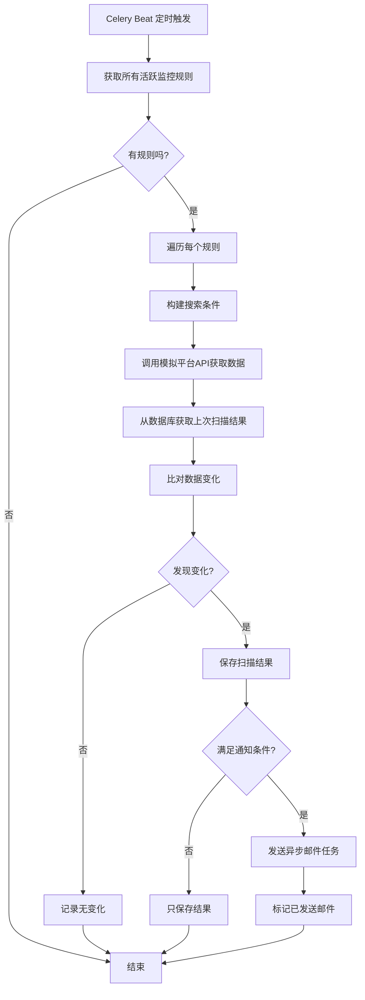

# 招聘信息监控系统架构图

## 🏗️ 整体架构

```
┌─────────────────────────────────────────────────────────────────────────────┐
│                              用户/第三方平台                                  │
│                         (浏览器 / API客户端)                                 │
└────────────┬────────────────────────────────────────────────┬───────────────┘
             │                                                │
             │ HTTP :8080                                     │ HTTP :5000
             │                                                │
   ┌─────────▼─────────┐                            ┌────────▼────────┐
   │                   │                            │                 │
   │   Frontend        │◄───── API 调用 ──────────►│   Backend       │
   │   (Vue 3)         │                            │   (Flask)       │
   │   Port: 8080      │                            │   Port: 5000    │
   │                   │                            │                 │
   │ ┌───────────────┐ │                            │ ┌─────────────┐ │
   │ │ - 仪表板      │ │                            │ │ - 用户认证  │ │
   │ │ - 监控规则    │ │                            │ │ - 监控规则  │ │
   │ │ - 扫描结果    │ │                            │ │ - 任务调度  │ │
   │ │ - 招聘搜索    │ │                            │ │ - 推送API   │ │
   │ │ - 平台监控    │ │                            │ │ - 邮件通知  │ │
   │ │ - API文档     │ │                            │ └─────────────┘ │
   │ └───────────────┘ │                            │                 │
   └───────────────────┘                            └────┬────┬───┬───┘
                                                          │    │   │
                                                          │    │   │
        ┌─────────────────────────────────────────────────┘    │   └──────────┐
        │                                                      │              │
        │                                                      │              │
┌───────▼────────┐                                    ┌────────▼──────┐  ┌───▼────────┐
│                │                                    │               │  │            │
│  PostgreSQL    │                                    │     Redis     │  │   邮件服务  │
│  Port: 5432    │                                    │   Port: 6379  │  │  (SMTP)    │
│                │                                    │               │  │            │
│ ┌────────────┐ │                                    │ ┌───────────┐ │  │            │
│ │ - users    │ │                                    │ │ - 任务队列│ │  │            │
│ │ - rules    │ │                                    │ │ - 缓存    │ │  │            │
│ │ - jobs     │ │                                    │ │ - 会话    │ │  │            │
│ │ - results  │ │                                    │ └───────────┘ │  │            │
│ └────────────┘ │                                    │               │  │            │
└────────────────┘                                    └───────┬───────┘  └────────────┘
                                                              │
                                                              │
                                          ┌───────────────────┴───────────────────┐
                                          │                                       │
                                  ┌───────▼────────┐                    ┌─────────▼────────┐
                                  │                │                    │                  │
                                  │ Celery Worker  │                    │  Celery Beat     │
                                  │                │                    │  (调度器)         │
                                  │ ┌────────────┐ │                    │                  │
                                  │ │ - 执行监控 │ │                    │ ┌──────────────┐ │
                                  │ │ - 发送邮件 │ │                    │ │ - 定时触发   │ │
                                  │ │ - 数据处理 │ │                    │ │   监控任务   │ │
                                  │ └────────────┘ │                    │ │ (每小时)     │ │
                                  │                │                    │ └──────────────┘ │
                                  └────────┬───────┘                    └──────────────────┘
                                           │
                                           │ HTTP 爬取数据
                                           │
                                  ┌────────▼────────┐
                                  │                 │
                                  │ Mock Platform   │
                                  │ (模拟招聘平台)   │
                                  │ Port: 5001      │
                                  │                 │
                                  │ ┌─────────────┐ │
                                  │ │ - 招聘数据  │ │
                                  │ │ - 动态更新  │ │
                                  │ │ - 统计API   │ │
                                  │ └─────────────┘ │
                                  └─────────────────┘
```

## 📊 数据流向图

### 用户操作流程

```
用户登录
   │
   ├─► [前端] 输入用户名密码
   │      │
   │      ▼
   │   [后端] JWT认证
   │      │
   │      ▼
   │   [数据库] 验证用户
   │      │
   │      ▼
   └──► 返回Token

创建监控规则
   │
   ├─► [前端] 填写监控条件
   │      │
   │      ▼
   │   [后端] 保存规则
   │      │
   │      ▼
   └──► [数据库] 存储规则

自动监控执行
   │
   ├─► [Celery Beat] 触发定时任务
   │      │
   │      ▼
   │   [Celery Worker] 获取活跃规则
   │      │
   │      ▼
   │   [数据库] 读取用户规则
   │      │
   │      ▼
   │   [Mock Platform] 爬取招聘数据
   │      │
   │      ▼
   │   [Celery Worker] 比对新旧数据
   │      │
   │      ├─► 发现变化 ─► [邮件服务] 发送通知
   │      │
   │      ▼
   └──► [数据库] 保存扫描结果
```

### 第三方推送流程

```
第三方平台
   │
   ├─► POST /api/v1/auth/login
   │      │
   │      ▼
   │   获取 Access Token
   │      │
   │      ▼
   │   POST /api/v1/jobs/push
   │      │
   │      ▼
   │   [后端] 验证Token
   │      │
   │      ▼
   │   [后端] 保存/更新职位
   │      │
   │      ▼
   │   [数据库] 存储职位数据
   │      │
   │      ▼
   │   [Celery Worker] 触发监控检查
   │      │
   │      ▼
   └──► 如有匹配规则 ─► 发送邮件通知
```

## 🔧 技术栈详解

### 前端层 (Frontend)
```
┌─────────────────────────────────────┐
│        Vue 3 + TypeScript            │
│                                      │
│  ┌────────────────────────────────┐ │
│  │  UI组件库                       │ │
│  │  - Ant Design Vue              │ │
│  │  - Icons                       │ │
│  └────────────────────────────────┘ │
│                                      │
│  ┌────────────────────────────────┐ │
│  │  状态管理                       │ │
│  │  - Pinia (auth store)          │ │
│  └────────────────────────────────┘ │
│                                      │
│  ┌────────────────────────────────┐ │
│  │  路由                           │ │
│  │  - Vue Router                  │ │
│  └────────────────────────────────┘ │
│                                      │
│  ┌────────────────────────────────┐ │
│  │  HTTP客户端                     │ │
│  │  - Axios + 拦截器              │ │
│  └────────────────────────────────┘ │
└─────────────────────────────────────┘
```

### 后端层 (Backend)
```
┌──────────────────────────────────────┐
│           Flask Web框架               │
│                                       │
│  ┌───────────────────────────────┐  │
│  │  认证与授权                    │  │
│  │  - Flask-JWT-Extended         │  │
│  │  - 用户注册/登录              │  │
│  └───────────────────────────────┘  │
│                                       │
│  ┌───────────────────────────────┐  │
│  │  路由 (Blueprints)            │  │
│  │  - /api/v1/auth               │  │
│  │  - /api/v1/monitoring-rules   │  │
│  │  - /api/v1/scan-results       │  │
│  │  - /api/v1/jobs               │  │
│  │  - /api/v1/jobs/push          │  │
│  └───────────────────────────────┘  │
│                                       │
│  ┌───────────────────────────────┐  │
│  │  数据库ORM                     │  │
│  │  - SQLAlchemy                 │  │
│  │  - Alembic (迁移)             │  │
│  └───────────────────────────────┘  │
│                                       │
│  ┌───────────────────────────────┐  │
│  │  任务队列                      │  │
│  │  - Celery                     │  │
│  │  - Redis Backend              │  │
│  └───────────────────────────────┘  │
│                                       │
│  ┌───────────────────────────────┐  │
│  │  邮件服务                      │  │
│  │  - Flask-Mail                 │  │
│  │  - SMTP配置                   │  │
│  └───────────────────────────────┘  │
│                                       │
│  ┌───────────────────────────────┐  │
│  │  API文档                       │  │
│  │  - Flasgger (Swagger)         │  │
│  └───────────────────────────────┘  │
└──────────────────────────────────────┘
```

### 数据层 (Database)
```
┌─────────────────────────────────────┐
│         PostgreSQL 15                │
│                                      │
│  ┌────────────────────────────────┐ │
│  │  users (用户表)                 │ │
│  │  - user_id (PK)                │ │
│  │  - username                    │ │
│  │  - email                       │ │
│  │  - password_hash               │ │
│  └────────────────────────────────┘ │
│                                      │
│  ┌────────────────────────────────┐ │
│  │  monitoring_rules (监控规则)    │ │
│  │  - rule_id (PK)                │ │
│  │  - user_id (FK)                │ │
│  │  - rule_name                   │ │
│  │  - keywords (JSON)             │ │
│  │  - filters (JSON)              │ │
│  └────────────────────────────────┘ │
│                                      │
│  ┌────────────────────────────────┐ │
│  │  jobs (招聘信息)                │ │
│  │  - job_id (PK)                 │ │
│  │  - company                     │ │
│  │  - position                    │ │
│  │  - skills (JSON)               │ │
│  │  - salary_min/max              │ │
│  │  - status                      │ │
│  └────────────────────────────────┘ │
│                                      │
│  ┌────────────────────────────────┐ │
│  │  scan_results (扫描结果)        │ │
│  │  - result_id (PK)              │ │
│  │  - rule_id (FK)                │ │
│  │  - jobs_new (JSON)             │ │
│  │  - jobs_updated (JSON)         │ │
│  │  - jobs_deleted (JSON)         │ │
│  │  - scan_time                   │ │
│  └────────────────────────────────┘ │
└─────────────────────────────────────┘
```

### 任务队列层 (Celery)
```
┌──────────────────────────────────────┐
│          Celery Distributed Tasks     │
│                                       │
│  ┌───────────────────────────────┐  │
│  │  Celery Beat (调度器)         │  │
│  │                                │  │
│  │  - 每小时执行监控任务          │  │
│  │  - execute_all_monitoring_    │  │
│  │    tasks (cron: 0 * * * *)    │  │
│  └───────────────────────────────┘  │
│                                       │
│  ┌───────────────────────────────┐  │
│  │  Celery Worker (执行器)       │  │
│  │                                │  │
│  │  异步任务:                     │  │
│  │  ├─ execute_monitoring_task   │  │
│  │  │  (执行单个监控规则)        │  │
│  │  │                             │  │
│  │  └─ send_monitoring_          │  │
│  │     notification               │  │
│  │     (发送邮件通知)            │  │
│  └───────────────────────────────┘  │
│                                       │
│  ┌───────────────────────────────┐  │
│  │  Redis (消息代理 + 结果后端)  │  │
│  │  - Broker: redis://           │  │
│  │  - Backend: redis://          │  │
│  └───────────────────────────────┘  │
└──────────────────────────────────────┘
```

## 🔄 核心业务流程

### 1. 监控任务执行流程



### 2. 用户注册登录流程

```
注册流程:
  用户 ─► 填写表单 ─► 前端验证 ─► 后端验证 ─► 密码加密 ─► 存入数据库 ─► 注册成功

登录流程:
  用户 ─► 输入凭证 ─► 后端验证 ─► 密码对比 ─► 生成JWT Token ─► 返回Token
          │
          └─► 后续请求携带Token ─► 验证Token ─► 允许访问
```

### 3. 第三方数据推送流程

```
┌──────────────┐       ┌──────────────┐       ┌──────────────┐
│ 第三方平台   │       │   Backend    │       │  Database    │
└──────┬───────┘       └──────┬───────┘       └──────┬───────┘
       │                      │                      │
       │ POST /auth/login     │                      │
       ├─────────────────────►│                      │
       │                      │ 验证用户              │
       │                      ├─────────────────────►│
       │                      │◄─────────────────────┤
       │◄─────────────────────┤                      │
       │   Token              │                      │
       │                      │                      │
       │ POST /jobs/push      │                      │
       │ + Token              │                      │
       ├─────────────────────►│                      │
       │                      │ 验证Token            │
       │                      ├─────────────────────►│
       │                      │ 保存/更新职位         │
       │                      ├─────────────────────►│
       │◄─────────────────────┤                      │
       │   成功响应           │                      │
       │                      │                      │
       │                      │ 触发监控检查          │
       │                      ├──────────┐          │
       │                      │          │          │
       │                      │◄─────────┘          │
       │                      │                      │
       │                      │ 如有匹配 ─► 发送邮件 │
       │                      │                      │
```

## 🌐 网络端口分配

| 服务 | 端口 | 协议 | 说明 |
|------|------|------|------|
| Frontend | 8080 | HTTP | Vue前端应用 |
| Backend | 5000 | HTTP | Flask后端API |
| Mock Platform | 5001 | HTTP | 模拟招聘平台 |
| PostgreSQL | 5432 | TCP | 数据库 |
| Redis | 6379 | TCP | 缓存和消息队列 |

## 🐳 Docker容器架构

```
┌─────────────────────────────────────────────────────────────┐
│                       Docker Network: default                │
│                                                              │
│  ┌──────────────┐  ┌──────────────┐  ┌──────────────┐     │
│  │  frontend    │  │   backend    │  │mock_platform │     │
│  │              │  │              │  │              │     │
│  │ nginx:alpine │  │ python:3.9   │  │ python:3.9   │     │
│  │              │  │              │  │              │     │
│  └──────────────┘  └──────────────┘  └──────────────┘     │
│                                                              │
│  ┌──────────────┐  ┌──────────────┐  ┌──────────────┐     │
│  │ celery_worker│  │ celery_beat  │  │   postgres   │     │
│  │              │  │              │  │              │     │
│  │ python:3.9   │  │ python:3.9   │  │postgres:15   │     │
│  │              │  │              │  │              │     │
│  └──────────────┘  └──────────────┘  └──────┬───────┘     │
│                                              │              │
│  ┌──────────────┐                           │              │
│  │    redis     │                           │              │
│  │              │                    ┌──────▼───────┐      │
│  │ redis:alpine │                    │    Volume    │      │
│  │              │                    │postgres_data │      │
│  └──────────────┘                    └──────────────┘      │
│                                                              │
└─────────────────────────────────────────────────────────────┘
```

## 📁 项目目录结构

```
end_system/
├── frontend/                    # 前端项目
│   ├── src/
│   │   ├── views/              # 页面组件
│   │   │   ├── Dashboard.vue   # 仪表板
│   │   │   ├── MonitoringRules.vue  # 监控规则
│   │   │   ├── ScanResults.vue      # 扫描结果
│   │   │   ├── Jobs.vue             # 招聘搜索
│   │   │   ├── PlatformMonitor.vue  # 平台监控
│   │   │   └── ApiDocs.vue          # API文档
│   │   ├── layouts/            # 布局组件
│   │   ├── stores/             # Pinia状态管理
│   │   └── router/             # 路由配置
│   └── Dockerfile
│
├── backend/                     # 后端项目
│   ├── app/
│   │   ├── routes/             # API路由
│   │   │   ├── auth.py         # 认证
│   │   │   ├── monitoring.py   # 监控规则
│   │   │   ├── scan_results.py # 扫描结果
│   │   │   ├── jobs.py         # 招聘搜索
│   │   │   └── push.py         # 第三方推送
│   │   ├── models/             # 数据模型
│   │   ├── tasks/              # Celery任务
│   │   │   ├── monitor.py      # 监控任务
│   │   │   └── email.py        # 邮件任务
│   │   └── __init__.py         # 应用工厂
│   ├── migrations/             # 数据库迁移
│   ├── config.py               # 配置文件
│   └── Dockerfile
│
├── mock_platform/               # 模拟招聘平台
│   ├── app/
│   │   ├── main.py             # 主应用
│   │   └── data_generator.py   # 数据生成器
│   └── Dockerfile
│
├── docker-compose.yml           # Docker编排
├── .env                         # 环境变量
│
└── 脚本文件/
    ├── 快速启动.sh              # 交互式管理
    ├── rebuild_all.sh           # 完整重建
    ├── check_monitoring.sh      # 监控诊断
    ├── backup.sh                # 数据备份
    └── update.sh                # Git更新
```

## 🔐 安全架构

```
┌─────────────────────────────────────────────────┐
│              安全层次                            │
│                                                  │
│  1. 网络层                                       │
│     - Docker Network隔离                        │
│     - 端口映射控制                              │
│     - UFW防火墙                                 │
│                                                  │
│  2. 应用层                                       │
│     - JWT Token认证                             │
│     - 密码哈希 (Werkzeug)                       │
│     - CORS跨域控制                              │
│     - SQL注入防护 (ORM)                         │
│                                                  │
│  3. 数据层                                       │
│     - 用户数据隔离 (user_id过滤)                │
│     - 数据库访问控制                            │
│     - 敏感信息加密存储                          │
│                                                  │
│  4. 传输层                                       │
│     - HTTPS (生产环境)                          │
│     - Nginx反向代理                             │
│     - SSL/TLS证书                               │
└─────────────────────────────────────────────────┘
```

---

## 💡 架构特点

### 优势
- ✅ **微服务架构** - 各组件独立，易于扩展和维护
- ✅ **容器化部署** - Docker统一环境，快速部署
- ✅ **异步处理** - Celery处理耗时任务，不阻塞主线程
- ✅ **前后端分离** - 开发独立，职责清晰
- ✅ **RESTful API** - 标准化接口，易于集成
- ✅ **可扩展性** - 可水平扩展Worker数量

### 可优化点
- 📈 添加Nginx负载均衡
- 📈 引入消息队列(RabbitMQ)替代Redis
- 📈 添加日志聚合系统(ELK)
- 📈 引入服务监控(Prometheus + Grafana)
- 📈 实现数据库读写分离
- 📈 添加缓存层(Memcached)

---

**Created:** 2024-10-28  
**Version:** 1.0.0

